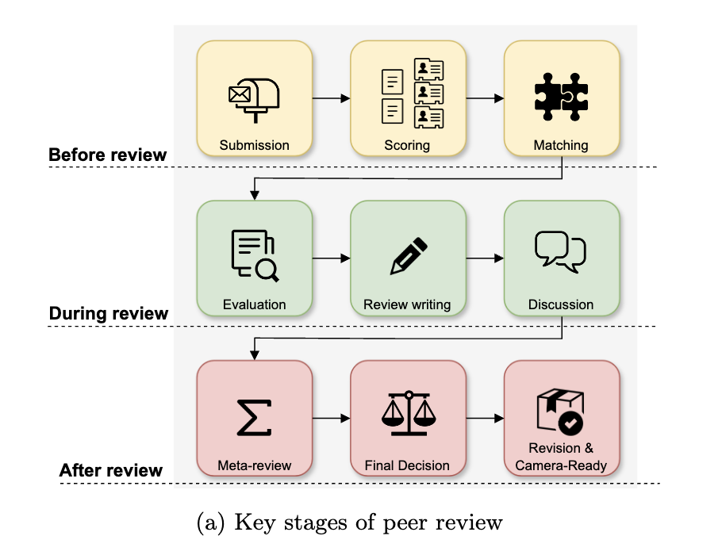

# nlp-for-peer-review



Here we compile existing Papers / Resources in NLP for Peer Review.

Please refer to our paper where we provide a foundation for the future efforts in NLP for peer
reviewing assistance. We discuss peer review as a general process, exemplified particularly by reviewing at
AI conferences. We detail each step of the process from manuscript submission to camera-ready revision,
and discuss the associated challenges and opportunities for NLP assistance, illustrated by existing work.

Paper: [What Can Natural Language Processing Do for Peer Review?](https://arxiv.org/)

## Background

The number of scientific articles produced every year is growing steadily, making quality control crucial for scientists and the public good. Peer review, a widely used process in which each submission is evaluated by several independent experts in the field, is hard, time-consuming, and prone to error. As the artifacts involved in peer review, such as manuscripts, reviews, and discussions, are largely text-based, natural language processing (NLP) has great potential to improve the reviewing process. However, it is essential to identify where help is needed, where NLP can assist, and where it should stand aside.

**Disclaimer: We may miss some relevant papers in the list. If you have any suggestions or would like to add some papers, please submit a pull request or email us. Your contribution is much appreciated!**

## Contents

- [nlp-for-peer-review](#nlp-for-peer-review)
  - [Background](#background)
  - [Contents](#contents)
    - [Resource List](#resource-list)
  - [Contributing](#contributing)
  - [Citation](#citation)


## Resource List


| Title | Data URL | Summary |
|-------|----------|---------|
| [Argument Mining for Understanding Peer Reviews](https://aclanthology.org/N19-1219/) | [Data](https://xinyuhua.github.io/Resources/naacl19/) | Peer reviews annotated by argumentative units and their types. The purpose of the dataset is the study of arguments in reviews across communities. |
| [DISAPERE: A Dataset for Discourse Structure in Peer Review Discussions](https://aclanthology.org/2022.naacl-main.89.pdf) | [Data](https://github.com/nnkennard/DISAPERE/tree/main) | Multi-layer-annotated dataset that matches review and rebuttal statements and categorizes them according to their communicative purpose. The dataset is supposed to enable research on the discourse structure between rebuttals and reviews. |
| [Automatic Analysis of Substantiation in Scientific Peer Reviews](https://aclanthology.org/2023.findings-emnlp.684.pdf) | [Data](https://github.com/YanzhuGuo/SubstanReview) | Peer reviews from NLP venues with claims about the paper and their associated evidences, if existent. The purpose of the dataset is the automatic detection of the lack of substantiation in reviews. |
| [Overview of PragTag-2023: Low-Resource Multi-Domain Pragmatic Tagging of Peer Reviews](https://aclanthology.org/2023.argmining-1.21.pdf) | *no | This shared task extends the NLPEER dataset with pragmatic tag annotations (communicative intents) on the COLING part of the data. The purpose of the dataset is the study of pragmatic tagging in reviews across communities and sciences. |
| [arXivEdits: Understanding the Human Revision Process in Scientific Writing](https://aclanthology.org/2022.emnlp-main.641/) | [Data](https://github.com/chaojiang06/arXivEdits) | Corpus of arxiv preprints with aligned edits labeled with intentions. |
| [When Reviewers Lock Horns: Finding Disagreements in Scientific Peer Reviews](https://aclanthology.org/2023.emnlp-main.1038/) | [Data](https://github.com/sandeep82945/Contradiction-in-Peer-Review) | automatically identifying contradictions between reviewers |
| [COMPARE: A Taxonomy and Dataset of Comparison Discussions in Peer Reviews](https://arxiv.org/abs/2108.04366) | [Data](https://github.com/shruti-singh/COMPARE) | identifying comparison sentences in peer reviews + taxonomy of comparison discussions |
| [Revise and Resubmit: An Intertextual Model of Text-based Collaboration in Peer Review](https://direct.mit.edu/coli/article/48/4/949/112555/Revise-and-Resubmit-An-Intertextual-Model-of-Text) | [Data](https://github.com/UKPLab/f1000rd) | The authors introduce a new dataset within the context of a novel intertextual text modeling framework. They annotate reviews with pragmatic tags (communicative intentions), their implicit and explicit references to the paper (links), and paper version alignment in the context of peer review. The dataset should enable the study of peer review from an intertextual perspective. |
| [APE: Argument Pair Extraction from Peer Review and Rebuttal via Multi-task Learning](https://aclanthology.org/2020.emnlp-main.569.pdf) | [Data](https://github.com/LiyingCheng95/ArgumentPairExtraction) | The authors introduce a new annotated dataset linking arguments in review reports to author rebuttals. The purpose of the dataset is the study of cross-document discourse structures in the context of peer review. |
| [CiteTracked: A Longitudinal Dataset of Peer Reviews and Citations](http://ceur-ws.org/Vol-2414/paper12.pdf) | *no | longitudinal analysis of reviews and citations |
| [NLPEER: A Unified Resource for the Computational Study of Peer Review](https://aclanthology.org/2023.acl-long.277.pdf) | [Data](https://tudatalib.ulb.tu-darmstadt.de/handle/tudatalib/3618) | The authors introduce a new benchmark dataset combining new datasets from ACL Rolling Review, COLING and F1000 Research with prior works in a unified format. The dataset enables  the development of NLP models for peer review assistance in a cross-domain and cross-temporal setting. |
| [ArgSciChat (Argumentative Dialogues on Scientific Papers)](https://aclanthology.org/2023.acl-long.425/) | [Data](https://github.com/UKPLab/acl2023-argscichat) | This new dataset comprises of argumentative dialogues between authors and information-seeking interlocutors based on NLP papers. The purpose of this dataset is the study the development of dialogue agents to query NLP papers, as well as understanding the information need of readers that arise from the paper abstracts. |
| [Summarizing Multiple Documents with Conversational Structure for Meta-Review Generation](https://aclanthology.org/2023.findings-emnlp.472/) | [Data](https://github.com/oaimli/PeerSum) | meta-review as a special kind of summary with additional features like conflicting information, full thread as input incl author response etc. |
| [Aspect-based Sentiment Analysis of Scientific Reviews](https://arxiv.org/abs/2006.03257) | [Data](TODO) | aspect-based sentiment analysis, as the title says, compare accepted and rejected papers, quantify disagreement between reviewers, aspect-score consistency |
| [Argument Mining Driven Analysis of Peer-Reviews](https://ojs.aaai.org/index.php/AAAI/article/view/16607) | [Data](https://github.com/fromm-m/aaai2021-am-peer-reviews) | argument mining to help editors, meta-reviewers and reviewers to extract relevant info from reviews. argument identification + stance detection |
| [ReviewerGPT? An Exploratory Study on Using Large Language Models for Paper Reviewing](https://arxiv.org/pdf/2306.00622.pdf) | [Data](https://github.com/niharshah/ReviewerGPT2023/) | Small-scale data to evaluate LLM reviewing. (1) Newly constructed short papers with planted errors; (2) Pairs of constructed abstracts where one is strictly better than the other; (3) Labeled NeurIPS author checklist. |
| [Can we automate scientific reviewing?](https://www.jair.org/index.php/jair/article/view/128622) | [Data](https://github.com/neulab/ReviewAdvisor) | big paper on different applications of NLP to peer review; lots of interesting insights into applications and review quality etc. (1) desiderata for good reviews; (2) collect a dataset of papers and annotate them; (3) train a summarization model on the dataset; (4) summarize 8 challenges in the pursuit of a good revew generation system. |
| [A Gold Standard Dataset for the Reviewer Assignment Problem](https://arxiv.org/pdf/2303.16750.pdf) | [Data](https://github.com/niharshah/goldstandard-reviewer-paper-match) | Researchers' own evaluations of their expertise in reviewing papers they have read. |
| [Does my rebuttal matter](https://aclanthology.org/N19-1129/) | yes, numerical-only | The authors release a dataset of anonymized review scores before and after rebuttal from the ACL 2018 conference. The purpose of the dataset is the study of confirmity bias and review scoring behavior in general. |
| [Exploring Jiu-Jitsu Argumentation for Writing Peer Review Rebuttals](https://aclanthology.org/2023.emnlp-main.894.pdf) | [Data](https://tudatalib.ulb.tu-darmstadt.de/handle/tudatalib/4000) | The authors model rebuttaling as jiu-jitsu argumentation and for this purpose create a dataset of review statements annoted with attitude roots, themes and associated canonical rebuttals. The purpose of the dataset is the study of review-rebutal dynamics as shaped by the reviewers prior believes. |
| [A Dataset of Peer Reviews (PeerRead): Collection, Insights and NLP Applications](https://aclanthology.org/N18-1149/) | [Data](https://github.com/allenai/PeerRead) | One of the first datasets of peer reviews from the NLP community including ACL papers. The purpose of the dataset is the study of acceptance prediction and review score prediction. |
| [HedgePeer (Uncertainty Detection)](https://dl.acm.org/doi/10.1145/3529372.3533300) | [Data](https://github.com/Tirthankar-Ghosal/HedgePeer-Dataset) | uncertainty detection in peer review texts. hedge cues + hedge spans; self-annotated confidence is often miscalibrated |
| [PolitePEER: does peer review hurt? A dataset to gauge politeness intensity in the peer reviews](https://link.springer.com/article/10.1007/s10579-023-09662-3) | [Data](https://github.com/PrabhatkrBharti/PolitePEER) | politeness classifier for peer review to develop politeness indicators |
| [ReAct (A Review Comment Dataset for Actionability)](https://arxiv.org/abs/2210.00443) | [Data](https://github.com/gtmdotme/ReAct) | review comment actionability classification |
| [Towards Automated Document Revision: Grammatical Error Correction, Fluency Edits, and Beyond](https://arxiv.org/abs/2205.11484) | [Data](https://github.com/chemicaltree/tetra) | dataset with papers from ACL anthology revised by professional editors, methods to detect improvements |
| [ARIES: A Corpus of Scientific Paper Edits Made in Response to Peer Reviews](https://arxiv.org/pdf/2306.12587.pdf) | [Data](https://github.com/allenai/aries) | The authors introduce a new small-scale corpus of peer review comments with paper edits made in response to them. The dataset should enable the development of approaches for generating peer feedback and paper editing in response to peer reviews. |
| [A Dataset on Malicious Paper Bidding in Peer Review](https://arxiv.org/pdf/2207.02303) | [Data](https://github.com/sjecmen/malicious_bidding_dataset) | A dataset from a controlled peer-review experiment pertaining to collusion ring behavior. |
| [Catch Me if I Can: Detecting Strategic Behaviour in Peer Assessment](https://arxiv.org/pdf/2010.04041.pdf) | [Data](https://cs.cmu.edu/~nihars/data/data_catch_me_if_i_can.zip) | A dataset from a controlled peer-review experiment pertaining to strategic reviewing: reviewers ranking competitors strategically to increase the chances of their own-authored papers getting accepted. |
| [Testing for Reviewer Anchoring in Peer Review: A Randomized Controlled Trial](https://arxiv.org/pdf/2307.05443.pdf) | [Data](https://github.com/theryanl/ReviewerAnchoring) | A dataset from a controlled peer-review experiment on reviewer anchoring in rebuttals. |
| [AAMAS Bidding Data](https://preflib.simonrey.fr/dataset/00037) | [Data](https://preflib.simonrey.fr/static/data/aamas/aamas.zip) | Anonymized bidding data from the AAMAS conference. |

- `*no`: This indicates that there is no data URL available for this particular resource. It is used in the table when a dataset does not have a corresponding publicly accessible data repository or download link.

## Contributing

If you would like to contribute to this repository, please submit a pull request. If you have any questions, feel free to contact us.

## Citation

```Coming soon!
